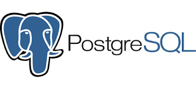

#Rock Lifter
Take a look underneath the rock and check out all the bugs.

## Delusions of Grandeur
* Hosted on my VPS
* Persistent auth with a JWT in localStorage
* Third party integration with github
* Third party auth with Auth0

## User Stories
Here is a link to my [User Stories](./planning/UserStories.md).

## Wireframes
Here is a link to my [Wireframes](./planning/WireFrames.md)

## Development Tool Stack
* IntelliJ
* Insomnia
* emacs(Doom)
* BeeKeeper Studio
* Alacritty
* Xmonad
* Google Chrome
* FireFox
* Byobu
* Zsh
* Linux (Manjaro)
* Vim

## Technologies Used

* Angular
* Heroku

## API endpoints
| Request Type | URL                          | Request Body      | Request Header | Function                 | 
|--------------|------------------------------|-------------------|----------------|--------------------------|
| GET          | /api/project/{projId}        | None              | None           | Get a specific project   |
| POST         | /api/project                 | title, content    | JPA Token      | Create new project       |
| GET          | /api/project/{id}/issue/{id} | None              | None           | Get a specific issue     |
| POST         | /api/project/{id}/issue      | title, content    | JPA Token      | Create A new issue       |
| PUT          | /api/project/{id}/issue/{id} | title, content    | JPA Token      | Update an existing issue |
----
