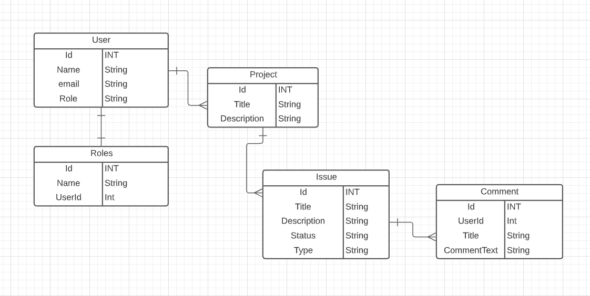
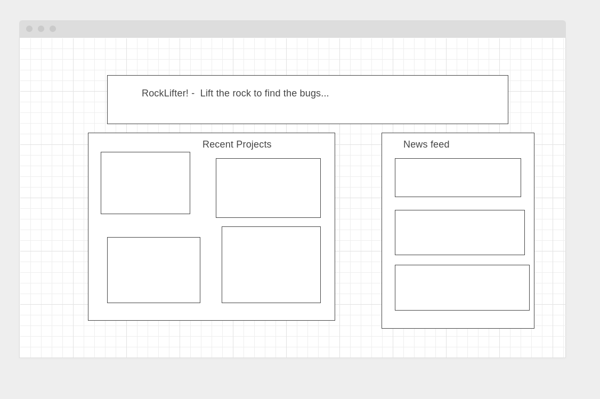
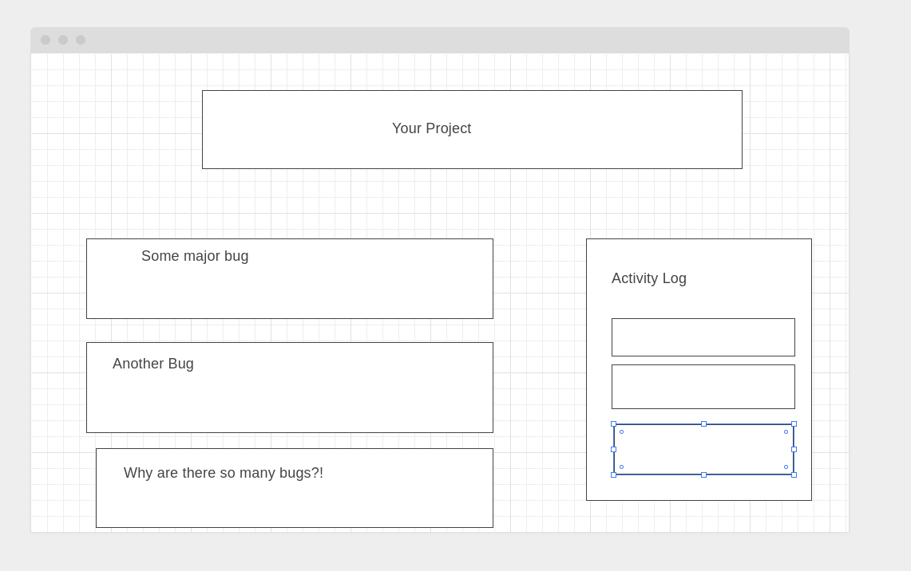
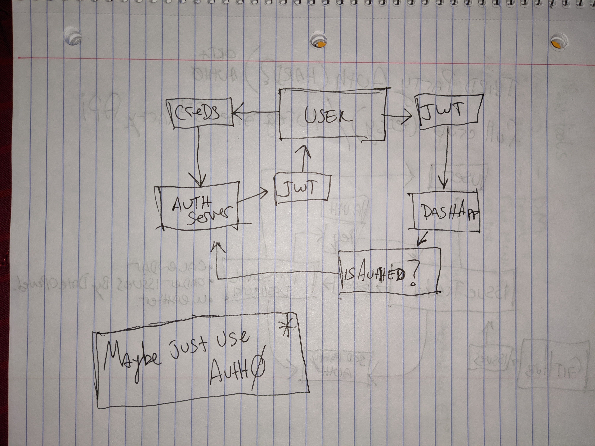
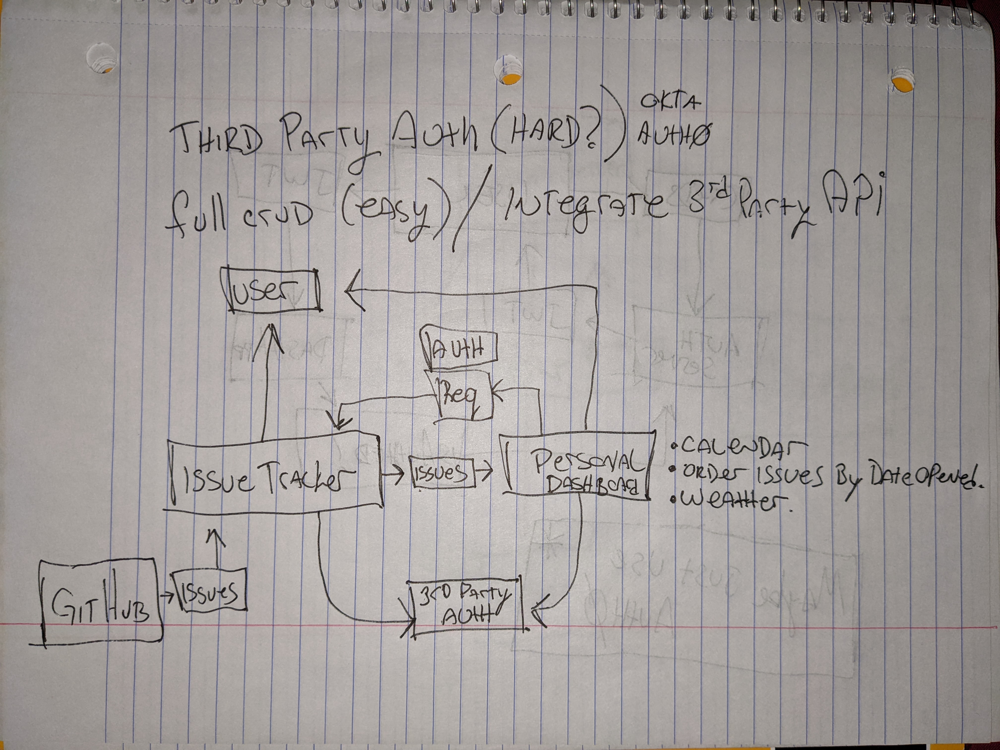

# Wireframes and other planning

## Data Model

## Wireframes
### Homepage

### Project screen

## Auth Planning
### This is how I was imagining the persistent auth would work.
( Turns out I was pretty close. )

